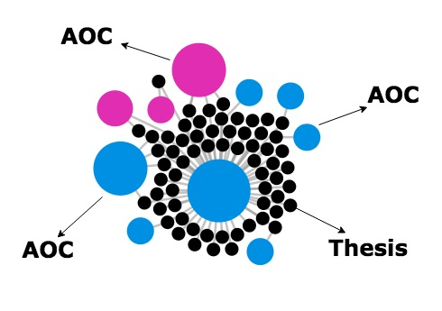
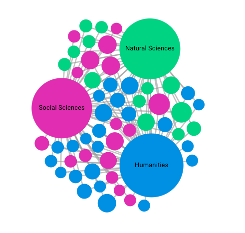

# ThesisLink ###v2

ThesisLink is a web application that visualizes over 50 years of metadata from undergraduate theses by New College of Florida students. It presents users with the following alternative: to view undergraduate theses as objects that are associated to each other via what we call "intellectual links," rather than as objects sitting independently in a repository.

**ThesisLink** uses PHP and Python in the backend and HTML, CSS and Javascript with Jquery and D3 libraries in the frontend. D3.js is a powerful Javascript library that brings data to life using HTML, SVG, and CSS and heavily used in the simulation page. Python script is used to scrape theses data from the original digital collection website ( http://ncf.sobek.ufl.edu/theses ) and can be run in any machine that Python is installed.

## What are we visualizing ?

ThesisLink visualizes the relationship between theses, divisions, and AOCs ( what we call majors here at New College ). It is helpful to understand the relationship between different AOCs and discover multidisciplinary theses. You can search or click on an AOC, and see all the theses in this AOC with their related AOCs. You can also target specific AOCs ( e. g. Computer Science, Economics, Political Science ) and see all theses that are related to those AOCs. 

### Filtering AOCs

There were many "small AOCs" that are not actually considered as AOCs but maybe topics added in the data. When showing AOCs, we had to limit the number of AOCs by eliminating the ones that have less than 10 theses (otherwise the visualization would be a complete mess). This gave us a clean list of AOCs to list under divisions. You will still see these "small AOCs" as related AOCs when you dive into an AOC.

## Future Work

ThesisLink is an important first step in introducing New College of Florida students and faculty to local metadata. We also think that ThesisLink is an important tool for marketing student theses, and, potentially, to guide faculty in program development. In the future, we want other schools to be able to import their data easily and get and create their own ThesisLink, visualizing the intellectual links at their institution.

## Building

Anyone can build the theses dashboard website using the files in this repository. Please follow these instructions:

1. Copy the files to a webserver
2. Create a MySQL user and a MySQL database
3. Change the "config.php" file under "system" folder
4. Import the sample sql file in the repository.

To update the theses:

1. Edit the MySQL configuration in the scraper (theses.py file).
2. Run the Python script.

